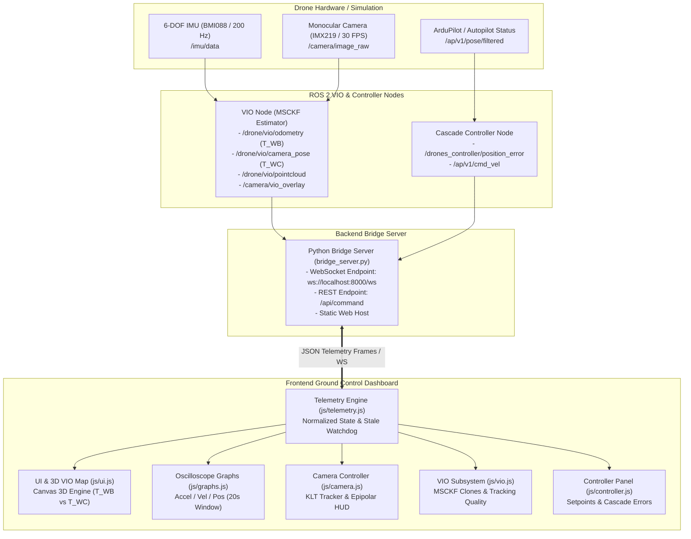

# 🛰️ AeroVIO Ground Station — Drone VIO & 3D Mapping Dashboard

An aerospace-grade, real-time Ground Control Station (GCS) and visualization frontend for Autonomous Multirotor Visual-Inertial Odometry (VIO), MSCKF state estimation, and 3D point-cloud mapping.

Connected to the [Autonomous Drone VIO & 3D Mapping Repository](https://github.com/Ravish2807/Drones_S5_CD2_3D_Mapping_using_normal_monocular_camera_controlling_Visual-Inertial-Odometry-VIO/tree/VIO-Controller).

---

## 🎯 Primary Flight Deck Questions Answered Instantly

1. **Is the drone/system connected?** → Dynamic WebSocket latency (`2.4 ms`), ROS 2 packet rate (`120 Hz`), and dynamic subsystem health.
2. **Is VIO healthy?** → Real-time MSCKF tracking quality (`91%`), active/tracked feature counts, sliding window clones ($C_{00} \dots C_{09}$), and covariance trace.
3. **Where is the drone?** → Body Trajectory ($T_{WB}$) in ENU world frame with 3D spatial ribbon and live $[X, Y, Z]$ instrumentation.
4. **What is the camera seeing?** → Monocular video feed with dynamic KLT feature velocity vectors, optical center reticle, and Camera Optical Trajectory ($T_{WC} = T_{WB} \cdot T_{BC}$).
5. **Is the controller stable?** → Cascade controller pipeline, attitude loop LQR damping, position error $\|e_p\|$, and rotor RPM telemetry.

---

## 🏗️ Architecture & Data Flow



---

## 📐 Coordinate Systems & Transformations

The system strictly distinguishes between drone body frame and camera optical frame:

- **Body Trajectory ($T_{WB}$)**: Represents the transformation from the Inertial World Frame ($W$) to the Drone IMU/Body Frame ($B$):
  $$T_{WB} \in \mathrm{SE}(3)$$
- **Camera Optical Trajectory ($T_{WC}$)**: Derived via online extrinsic transform $T_{BC}$:
  $$T_{WC} = T_{WB} \cdot T_{BC}$$
  where $T_{BC}$ is the physical rigid body mount calibration (+10cm forward, -4cm down, $-15^\circ$ down-tilt pitch).

---

## 📂 Frontend Modular Directory Structure

```
.
├── index.html                  # Aerospace Avionics Cockpit Layout
├── bridge_server.py            # Zero-dependency HTTP & WebSocket Bridge Server
├── css/
│   └── dashboard.css           # Aerospace dark HUD styles & animations
├── js/
│   ├── telemetry.js            # Normalized state store, watchdog & demo player
│   ├── websocket.js            # WebSocket client, latency tracker & reconnect
│   ├── graphs.js               # 3 Live rolling SVG charts (Accel / Vel / Pos)
│   ├── camera.js               # Monocular video & dynamic KLT feature HUD
│   ├── vio.js                  # MSCKF estimator diagnostics & tracking quality
│   ├── controller.js           # Cascade control pipeline & setpoint dispatch
│   └── ui.js                   # 3D canvas map, layer toggles, modals & toasts
├── data/
│   ├── real_data.js            # Inlined JSON datasets for instant browser replay
│   ├── synthetic_orbit_estimated_trajectory.csv
│   ├── synthetic_hover_estimated_trajectory.csv
│   ├── synthetic_straight_estimated_trajectory.csv
│   ├── synthetic_multi_axis_estimated_trajectory.csv
│   ├── synthetic_stress_estimated_trajectory.csv
│   └── synthetic_orbit_scanned_map.pcd  # 442 Real Triangulated 3D Landmarks
├── drone_prototype_render.png  # Quadrotor avionics centerpiece visual
└── monocular_tracking_feed.png # High-res monocular optics tracking frame
```

---

## 🚀 Quickstart & Running Instructions

### 1. Launch Ground Station Server
```bash
python bridge_server.py
```
*Runs HTTP server on `http://localhost:8000` and WebSocket bridge on `ws://localhost:8000/ws`.*

### 2. Open in Browser
Open `http://localhost:8000` in any modern web browser.

### 3. Dual Operational Modes
- **`[ DEMO MODE ]`**: Replays real recorded trajectory datasets from the GitHub repository (`synthetic_orbit`, `synthetic_hover`, `synthetic_straight`, `synthetic_multi_axis`, `synthetic_stress`) with 442 triangulated PCD landmarks.
- **`[ LIVE ROS 2 ]`**: Connects via WebSocket to `ws://localhost:8000/ws` or rosbridge to stream live telemetry from active ROS 2 nodes. Shows graceful disconnected/stale indicators when ROS 2 is offline.

---

## 📡 ROS 2 Topics Interface

| Topic Name | Message Type | Rate | Description |
| :--- | :--- | :--- | :--- |
| `/drone/vio/odometry` | `nav_msgs/Odometry` | 60 Hz | Filtered body state ($T_{WB}$, linear velocity, covariance) |
| `/drone/vio/camera_pose` | `geometry_msgs/PoseStamped` | 30 Hz | Optical camera pose ($T_{WC} = T_{WB} \cdot T_{BC}$) |
| `/drone/vio/pointcloud` | `sensor_msgs/PointCloud2` | 10 Hz | Triangulated 3D sparse landmark point cloud |
| `/camera/image_raw` | `sensor_msgs/Image` | 30 Hz | Raw monocular camera frame |
| `/camera/vio_overlay` | `sensor_msgs/Image` | 30 Hz | Monocular frame with FAST corners & optical flow |
| `/imu/data` | `sensor_msgs/Imu` | 200 Hz | 6-DOF linear acceleration and angular rates |
| `/drones_controller/position_error` | `geometry_msgs/Vector3` | 50 Hz | Closed-loop Cartesian tracking error $\|e_p\|$ |
| `/ap/v1/cmd_vel` | `geometry_msgs/TwistStamped` | 50 Hz | Autopilot attitude/rate actuation commands |

---

## 📄 License
MIT License. Developed for Drone Visual-Inertial Odometry & 3D Mapping Research.
