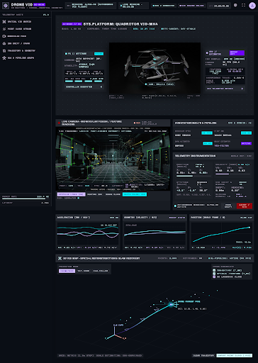
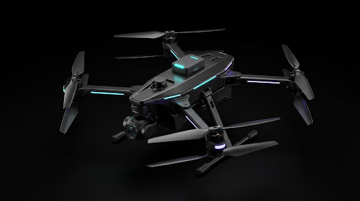
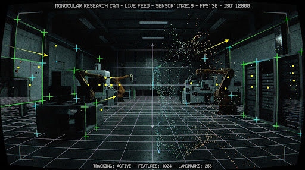

# 🛰️ Drone VIO Ground Control Dashboard

An advanced, high-precision avionics ground control interface designed for autonomous drones equipped with Monocular Visual-Inertial Odometry (VIO), real-time 3D point cloud mapping, and ROS 2 telemetry streaming.



---

## ⚡ Features

- **Spatial VIO Matrix & HUD**: Real-time position, velocity, orientation (quaternions & Euler angles), and attitude stability telemetry.
- **3D Point Cloud & Trajectory Stream**: Interactive point cloud mapping viewer with dynamic drift covariance calculations.
- **Monocular Feature Tracking Feed**: Live camera feed with optical flow landmark points and keyframe tracking crosshairs.
- **ROS 2 Pipeline Graph & Diagnostics**: High-frequency packet rate monitor (120+ Hz), latency tracking (<5ms), and node status inspection.
- **Avionics Cockpit Aesthetics**: Dark-mode HUD design tailored for mission control and field engineering operations.

---

## 🚁 Drone Hardware Configuration



- **Airframe**: Toray T700 Carbon Fiber Quadrotor
- **All-Up Weight (AUW)**: 1.42 kg
- **Power Bus**: 14.8V (4S LiPo)
- **Sensor Suite**:
  - Global Shutter Monocular Optical Flow Camera
  - 6-DoF Low-Noise Industrial IMU (Acc + Gyro)
  - RTK-GPS Dual-Antenna Subsystem
  - LiDAR Rangefinder Module

---

## 📷 Monocular Camera Optical Tracking



---

## 🚀 Quick Start

1. Clone this repository:
   ```bash
   git clone https://github.com/iamakhilan/Drones-Dashboard.git
   cd Drones-Dashboard
   ```

2. Open `index.html` in any modern web browser or serve it locally:
   ```bash
   # Using Python built-in HTTP server:
   python -m http.server 8000
   ```
   Then navigate to `http://localhost:8000` in your browser.

---

## 🛠️ Tech Stack

- **UI / Styling**: HTML5, Tailwind CSS, Google Chivo & Space Mono Fonts, Material Symbols
- **Visual Design**: Generated via Google Stitch & Antigravity
