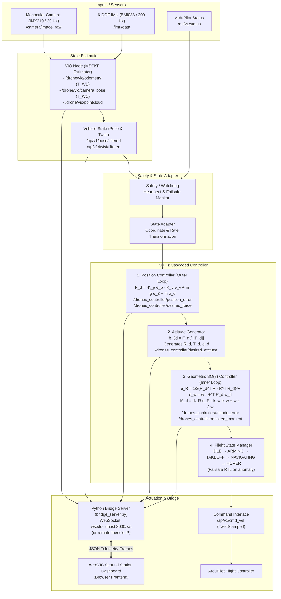

# 🛰️ AeroVIO Ground Station — 50 Hz Cascaded SO(3) Controller & 3D VIO Dashboard

An aerospace-grade, real-time Ground Control Station (GCS) and visualization frontend for Autonomous Drone Visual-Inertial Odometry (VIO), MSCKF state estimation, 3D point-cloud mapping, and 50 Hz cascaded closed-loop flight control.

Connected to the [Autonomous Drone VIO & Controller Repository](https://github.com/Ravish2807/Drones_S5_CD2_3D_Mapping_using_normal_monocular_camera_controlling_Visual-Inertial-Odometry-VIO/tree/drones-controller).

---

## 🎯 Primary Flight Deck Questions Answered Instantly

1. **Is the drone/system connected?** → Dynamic WebSocket latency (`2.1 ms`), stream packet rate (`50 Hz`), and dynamic subsystem health.
2. **Is VIO healthy?** → Real-time MSCKF tracking quality (`91%`), active/tracked feature counts, sliding window clones ($C_{00} \dots C_{09}$), and covariance trace.
3. **Where is the drone?** → Body Trajectory ($T_{WB}$) in ENU world frame with 3D spatial ribbon and live $[X, Y, Z]$ instrumentation.
4. **What is the camera seeing?** → Monocular video feed with dynamic KLT feature velocity vectors, optical center reticle, and Camera Optical Trajectory ($T_{WC} = T_{WB} \cdot T_{BC}$).
5. **Is the controller stable?** → 50 Hz cascaded closed-loop control pipeline, position error $\|e_p\|$, desired force $\|F_d\|$, $\mathrm{SO}(3)$ geometric attitude error $\|e_R\|$, and desired moment $\|M_d\|$.

---

## 🏗️ Actual Cascaded Controller Architecture (`drones-controller`)

The system implements a cascaded closed-loop controller operating at **50 Hz**:



---

## 📐 Mathematical Formulations

### 1. Outer Loop: Position Controller
- **Position Error**:
  $$e_p = p - p_d = [e_{px}, e_{py}, e_{pz}]^T, \quad \|e_p\|$$
- **Velocity Error**:
  $$e_v = v - v_d = [e_{vx}, e_{vy}, e_{vz}]^T, \quad \|e_v\|$$
- **Desired Force**:
  $$F_d = -K_p e_p - K_v e_v + m g e_3 + m a_d$$
  where $m = 1.5\text{ kg}$, $K_p = [0.5, 0.5, 0.5]$, $K_v = [0.2, 0.2, 0.2]$.

### 2. Attitude Generator
- **Desired Body Z-Axis (Thrust Direction)**:
  $$b_{3d} = \frac{F_d}{\|F_d\|}$$
- **Collective Thrust**:
  $$T_d = F_d \cdot R e_3 = \|F_d\|$$
- Produces desired rotation matrix $R_d \in \mathrm{SO}(3)$ and quaternion $q_d = [q_{dw}, q_{dx}, q_{dy}, q_{dz}]$.

### 3. Inner Loop: Geometric $\mathrm{SO}(3)$ Attitude Controller
- **Attitude Error**:
  $$e_R = \frac{1}{2} (R_d^T R - R^T R_d)^\vee = [e_{Rx}, e_{Ry}, e_{Rz}]^T, \quad \|e_R\|$$
- **Angular Velocity Error**:
  $$e_\omega = \omega - R^T R_d \omega_d = [e_{\omega x}, e_{\omega y}, e_{\omega z}]^T, \quad \|e_\omega\|$$
- **Desired Control Moment**:
  $$M_d = -k_R e_R - k_\Omega e_\omega + \omega \times J \omega$$
  where $J = \mathrm{diag}(0.02, 0.02, 0.04)\text{ kg}\cdot\text{m}^2$.

---

## 📡 ROS 2 Topics Interface

### Controller Inputs:
| Topic Name | Message Type | Rate | Description |
| :--- | :--- | :--- | :--- |
| `/ap/v1/pose/filtered` | `geometry_msgs/PoseStamped` | 50 Hz | Current estimated drone pose ($p, q$) |
| `/ap/v1/twist/filtered` | `geometry_msgs/TwistStamped` | 50 Hz | Current estimated linear & angular velocity ($v, \omega$) |
| `/ap/v1/status` | `ardupilot_msgs/Status` | 10 Hz | Autopilot armed, failsafe, and flight state |

### Controller Outputs:
| Topic Name | Message Type | Rate | Description |
| :--- | :--- | :--- | :--- |
| `/ap/v1/cmd_vel` | `geometry_msgs/TwistStamped` | 50 Hz | Final actuation control command to ArduPilot |
| `/drones_controller/position_error` | `geometry_msgs/Vector3` | 50 Hz | Position tracking error $e_p$ |
| `/drones_controller/velocity_error` | `geometry_msgs/Vector3` | 50 Hz | Velocity tracking error $e_v$ |
| `/drones_controller/desired_force` | `geometry_msgs/Vector3` | 50 Hz | Computed force vector $F_d$ |
| `/drones_controller/desired_moment` | `geometry_msgs/Vector3` | 50 Hz | Computed $\mathrm{SO}(3)$ control moment $M_d$ |
| `/drones_controller/attitude_error` | `geometry_msgs/Vector3` | 50 Hz | $\mathrm{SO}(3)$ attitude error $e_R$ |
| `/drones_controller/angular_velocity_error` | `geometry_msgs/Vector3` | 50 Hz | Angular rate error $e_\omega$ |
| `/drones_controller/desired_attitude` | `geometry_msgs/Quaternion` | 50 Hz | Desired attitude quaternion $q_d$ |

### VIO Node Topics:
| Topic Name | Message Type | Rate | Description |
| :--- | :--- | :--- | :--- |
| `/drone/vio/odometry` | `nav_msgs/Odometry` | 60 Hz | Body odometry $T_{WB}$ |
| `/drone/vio/camera_pose` | `geometry_msgs/PoseStamped` | 30 Hz | Optical camera pose $T_{WC} = T_{WB} \cdot T_{BC}$ |
| `/drone/vio/pointcloud` | `sensor_msgs/PointCloud2` | 10 Hz | Triangulated 3D sparse landmarks |
| `/camera/image_raw` | `sensor_msgs/Image` | 30 Hz | Raw monocular camera frame |

---

## 📂 Frontend Architecture & Directory Structure

```
.
├── index.html                  # Aerospace Avionics Cockpit Layout
├── bridge_server.py            # Zero-dependency HTTP & WebSocket Bridge Server
├── css/
│   └── dashboard.css           # Aerospace dark HUD styles & animations
├── js/
│   ├── telemetry.js            # Normalized state store (Position, SO(3), VIO)
│   ├── websocket.js            # Configurable WebSocket client (Local / Remote LAN)
│   ├── controller.js           # 50 Hz Cascaded controller inspector & setpoints
│   ├── graphs.js               # 3 Live rolling SVG charts (Accel / Vel / Pos)
│   ├── camera.js               # Monocular video & dynamic KLT feature HUD
│   ├── vio.js                  # MSCKF estimator diagnostics & tracking quality
│   └── ui.js                   # 3D canvas map (T_WB vs T_WC), FSM, modals & toasts
├── data/
│   ├── real_data.js            # Inlined JSON datasets for instant browser replay
│   ├── synthetic_orbit_estimated_trajectory.csv
│   ├── synthetic_hover_estimated_trajectory.csv
│   ├── synthetic_straight_estimated_trajectory.csv
│   ├── synthetic_multi_axis_estimated_trajectory.csv
│   ├── synthetic_stress_estimated_trajectory.csv
│   └── synthetic_orbit_scanned_map.pcd  # 442 Real Triangulated 3D Landmarks
├── drone_prototype_render.png  # Quadrotor avionics centerpiece visual
└── monocular_tracking_feed.png # High-res monocular optics tracking frame
```

---

## 🚀 Quickstart & Running Instructions

### 1. Launch Ground Station Server
```bash
python bridge_server.py
```

### 2. Open in Browser
Open `http://localhost:8000` in your web browser.

### 3. Remote ROS 2 Connection Setup
In **Controller Tuning / Inspector Modal**, you can set the **Remote WebSocket Bridge Endpoint** (e.g. `ws://192.168.1.105:8000/ws` for a friend's machine running ROS 2 on the local network).

---

## 📄 License
MIT License. Developed for Drone Visual-Inertial Odometry & Geometric $\mathrm{SO}(3)$ Control Research.
