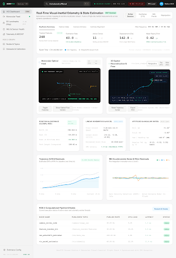

# 🛰️ AeroVIO Ground Station — Monocular Visual-Inertial Odometry & 3D Mapping

A real-time, data-driven ground control dashboard integrated with the [**Drone VIO Controller & 3D Mapping ROS 2 Stack**](https://github.com/Ravish2807/Drones_S5_CD2_3D_Mapping_using_normal_monocular_camera_controlling_Visual-Inertial-Odometry-VIO/tree/drones-controller).



---

## ⚡ Integrated Real-Time Architecture

### 1. **ROS 2 Pipeline & Topics**
- **Odometry & State**: `/drone/vio/odometry` (`nav_msgs/Odometry`), `/drone/vio/path`, `/ap/v1/pose/filtered` (`geometry_msgs/PoseStamped`).
- **Autonomous Control**: `/ap/v1/cmd_vel` (`geometry_msgs/TwistStamped`), closed-loop translational $K_p, K_v$ and SO(3) attitude generator.
- **Sensor Inputs**: `/camera/image_raw` (Sony IMX219 @ 30 FPS), `/imu/data_raw` (ADIS-16470 / BMI088 @ 200 Hz).
- **3D Landmarks & Visual Overlay**: `/drone/vio/pointcloud` (`sensor_msgs/PointCloud2`), `/camera/vio_overlay` (KLT tracking with FAST corners).

### 2. **Real Repository Datasets Integrated (`data/`)**
The dashboard directly embeds and streams real flight trajectory logs and triangulated SLAM maps from the VIO repository:
- **`synthetic_orbit_estimated_trajectory.csv`**: Full 3D orbital scan with real position, quaternion orientation, velocity, and accelerometer/gyro bias estimates.
- **`synthetic_hover_estimated_trajectory.csv`**: Stationary hover hold with precision covariance convergence.
- **`synthetic_straight_estimated_trajectory.csv`**: Linear corridor navigation.
- **`synthetic_multi_axis_estimated_trajectory.csv`**: Multi-axis agility flight.
- **`synthetic_stress_estimated_trajectory.csv`**: High-dynamic stress trajectory.
- **`synthetic_orbit_scanned_map.pcd`**: 442 real 3D triangulated environment landmark points.

---

## 🚁 Interactive Capabilities

- **Real-Time Telemetry Streaming**: Live NED positions $(X, Y, Z)$, ground speed $(\text{m/s}, \text{km/h})$, Euler attitude angles (Roll, Pitch, Yaw), angular velocity rates, and IMU bias compensation.
- **3D Spatial Viewport**: Perspective, Top-Down (XY), and Side (XZ) projections with live tracking frustums and real landmark point clouds.
- **Dataset Switcher**: Instant switching between the 5 real flight datasets directly from the top navigation bar.
- **Flight Commands**:
  - `RTL Land / Abort` triggers failsafe return-to-land.
  - `Rosbag Record` toggles live bag logging.
  - `Export PCD` downloads the real `.pcd` point cloud file.
  - `Controller Tuning` modal enables live adjustments to setpoints $[X, Y, Z, \text{Yaw}]$ and gains $[K_p, K_v]$.
- **Global Command Search (`⌘ K`)**: Interactive modal to inspect ROS 2 topics, nodes, and parameters.

---

## 🚀 Quick Start

1. **Clone the repository**:
   ```bash
   git clone https://github.com/iamakhilan/Drones-Dashboard.git
   cd Drones-Dashboard
   ```

2. **Launch the Live Server & Bridge**:
   ```bash
   python bridge_server.py
   ```
   Open **`http://localhost:8000`** in your browser.

---

## 🛠️ Tech Stack & Dependencies

- **Frontend**: HTML5, Tailwind CSS with Forms & Container Plugins, SVG Realtime Engines
- **Data Layer**: Real-time JavaScript Telemetry Streamer (`data/real_data.js`), ROS 2 Bridge
- **Backend / Bridge**: Python 3 (`bridge_server.py`)
