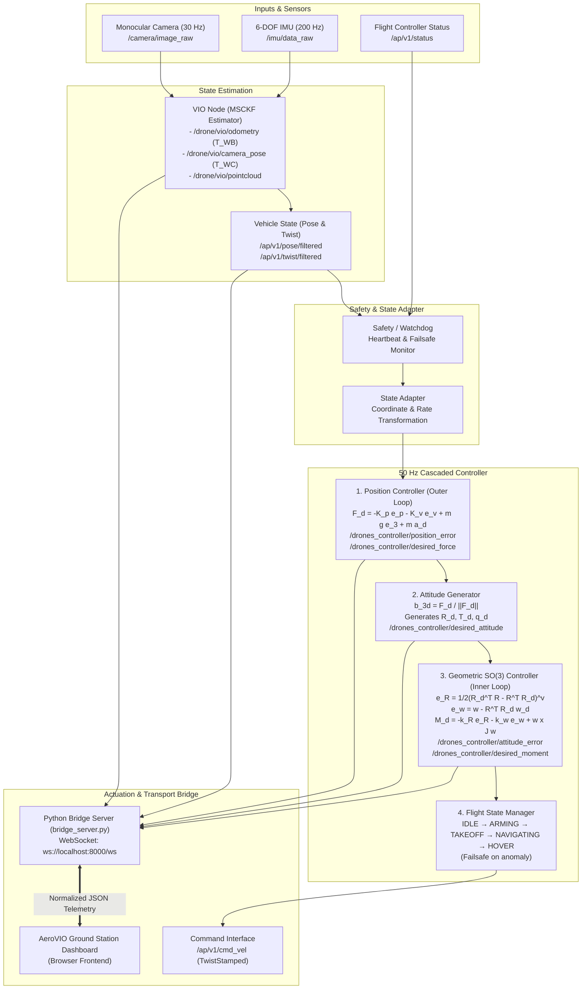

# 🛰️ AeroVIO Ground Station — Drone VIO & Cascaded SO(3) Controller Dashboard

An aerospace-grade, real-time Ground Control Station (GCS) and visualization frontend designed for Autonomous Drone Visual-Inertial Odometry (VIO), MSCKF state estimation, 3D point-cloud mapping, and 50 Hz cascaded closed-loop flight control.

Designed to interface with the [Autonomous Drone VIO & Controller Architecture](https://github.com/Ravish2807/Drones_S5_CD2_3D_Mapping_using_normal_monocular_camera_controlling_Visual-Inertial-Odometry-VIO/tree/drones-controller).

---

## 📊 System Implementation Status

### ✅ Implemented Now
- **Dashboard Frontend UI**: Clean light-themed ground station dashboard with metric KPI cards, precision kinematics matrices, and topic inspection.
- **VIO Visualizations**:
  - Monocular camera feed with dynamic KLT feature velocity vectors, optical reticle, and Brown-Conrady camera parameters.
  - 3D spatial reconstruction with 442 PCD landmarks (`synthetic_orbit_scanned_map.pcd`).
  - Strict mathematical frame separation: Body Trajectory $T_{WB}$ vs Camera Optical Trajectory $T_{WC} = T_{WB} \cdot T_{BC}$.
  - Multi-angle projection switcher (Isometric, Top XY, Side XZ).
- **50 Hz Cascaded Closed-Loop Controller Telemetry**:
  - Outer Loop: Position error $e_p = p - p_d$, velocity error $e_v = v - v_d$, desired force $F_d = -K_p e_p - K_v e_v + m g e_3 + m a_d$.
  - Attitude Generator: Thrust direction $b_{3d} = F_d / \|F_d\|$, collective thrust $T_d = \|F_d\|$, desired attitude $R_d$ ($q_d$).
  - Inner Loop: Geometric $\mathrm{SO}(3)$ attitude error $e_R = \frac{1}{2}(R_d^T R - R^T R_d)^\vee$, angular velocity error $e_\omega = \omega - R^T R_d \omega_d$, desired moment $M_d = -k_R e_R - k_\Omega e_\omega + \omega \times J \omega$.
  - Flight FSM state tracker (`IDLE` $\to$ `ARMING` $\to$ `TAKEOFF` $\to$ `NAVIGATING` $\to$ `HOVER` / `FAILSAFE`).
  - Safety watchdog heartbeat monitor.
- **Live Kinematic Oscilloscope Graphs**:
  - 3 real-time rolling 20-second SVG charts for Linear Acceleration ($a_x, a_y, a_z$), Velocity ($v_x, v_y, v_z$), and Position ($x, y, z$).
  - Pause / Resume and buffer clear controls.
- **DEMO Telemetry Playback Engine**:
  - Replays 5 calibrated flight trajectory datasets (`orbit`, `hover`, `corridor`, `multi_axis`, `stress`).
  - Dynamically calculates closed-loop controller outputs and KLT feature motion at 50 Hz.
- **WebSocket Transport Bridge (`bridge_server.py`)**:
  - Zero-dependency Python server supporting HTTP file serving and WebSocket streaming on `/ws`.
  - Configurable remote endpoint (`ws://[IP]:8000/ws`) for cross-machine LAN connection.
  - Truthful connection reporting (distinguishes WebSocket bridge connection from ROS 2 live node connection).

### ⏳ Planned / Integration Stage
- **Live ROS 2 Node Adapter**: Native `rclpy` bridge node subscribing to live ROS 2 topics on the companion computer and pushing normalized JSON frames to the bridge.
- **Live Vehicle Telemetry**: Active in-flight stream from hardware IMU (ADIS16470 / BMI088) and optical camera over ROS 2 topics.
- **Physical ArduPilot Actuation**: Real `/ap/v1/cmd_vel` command forwarding to physical aircraft flight controller (currently commands only update simulator setpoints).

---

## 🏗️ Actual Cascaded Controller Architecture (`drones-controller`)

The system architecture matches the 50 Hz cascaded closed-loop control pipeline:



---

## 📐 Mathematical Formulations

### 1. Outer Loop: Position Controller
- **Position Error**:
  $$e_p = p - p_d = [e_{px}, e_{py}, e_{pz}]^T$$
- **Velocity Error**:
  $$e_v = v - v_d = [e_{vx}, e_{vy}, e_{vz}]^T$$
- **Desired Force**:
  $$F_d = -K_p e_p - K_v e_v + m g e_3 + m a_d$$
  where $m = 1.50\text{ kg}$, $K_p = [0.5, 0.5, 0.5]$, $K_v = [0.2, 0.2, 0.2]$.

### 2. Attitude Generator
- **Thrust Direction Vector**:
  $$b_{3d} = \frac{F_d}{\|F_d\|}$$
- **Collective Thrust**:
  $$T_d = \|F_d\|$$
- Produces desired rotation matrix $R_d \in \mathrm{SO}(3)$ and desired orientation quaternion $q_d$.

### 3. Inner Loop: Geometric $\mathrm{SO}(3)$ Attitude Controller
- **Attitude Error**:
  $$e_R = \frac{1}{2} (R_d^T R - R^T R_d)^\vee = [e_{Rx}, e_{Ry}, e_{Rz}]^T$$
- **Angular Velocity Error**:
  $$e_\omega = \omega - R^T R_d \omega_d = [e_{\omega x}, e_{\omega y}, e_{\omega z}]^T$$
- **Desired Control Moment**:
  $$M_d = -k_R e_R - k_\Omega e_\omega + \omega \times J \omega$$
  where $J = \mathrm{diag}(0.02, 0.02, 0.04)\text{ kg}\cdot\text{m}^2$, $k_R = [4.85, 4.85, 2.50]$, $k_\Omega = [0.35, 0.35, 0.20]$.

### 4. Frame Extrinsics
- **Camera Optical Pose**:
  $$T_{WC} = T_{WB} \cdot T_{BC}$$
  where $T_{BC} = [+0.10, 0.00, -0.04]\text{ m}$ forward/downward offset.

---

## 📡 Verified ROS 2 Topic Contracts

### Controller Inputs:
| Topic Name | Message Type | Rate | Description |
| :--- | :--- | :--- | :--- |
| `/ap/v1/pose/filtered` | `geometry_msgs/PoseStamped` | 50 Hz | Current estimated drone pose ($p, q$) |
| `/ap/v1/twist/filtered` | `geometry_msgs/TwistStamped` | 50 Hz | Current estimated linear & angular velocity ($v, \omega$) |
| `/ap/v1/status` | `ardupilot_msgs/Status` | 10 Hz | Autopilot armed, failsafe, and flight state |

### Controller Telemetry Outputs:
| Topic Name | Message Type | Rate | Description |
| :--- | :--- | :--- | :--- |
| `/ap/v1/cmd_vel` | `geometry_msgs/TwistStamped` | 50 Hz | Actuation command to ArduPilot |
| `/drones_controller/position_error` | `geometry_msgs/Vector3` | 50 Hz | Position tracking error $e_p$ |
| `/drones_controller/velocity_error` | `geometry_msgs/Vector3` | 50 Hz | Velocity tracking error $e_v$ |
| `/drones_controller/desired_force` | `geometry_msgs/Vector3` | 50 Hz | Computed force vector $F_d$ |
| `/drones_controller/desired_moment` | `geometry_msgs/Vector3` | 50 Hz | Computed $\mathrm{SO}(3)$ control moment $M_d$ |
| `/drones_controller/attitude_error` | `geometry_msgs/Vector3` | 50 Hz | $\mathrm{SO}(3)$ attitude error $e_R$ |
| `/drones_controller/angular_velocity_error` | `geometry_msgs/Vector3` | 50 Hz | Angular rate error $e_\omega$ |
| `/drones_controller/desired_attitude` | `geometry_msgs/Quaternion` | 50 Hz | Desired attitude quaternion $q_d$ |

### VIO Node Topics:
| Topic Name | Message Type | Rate | Description |
| :--- | :--- | :--- | :--- |
| `/drone/vio/odometry` | `nav_msgs/Odometry` | 60 Hz | Body odometry $T_{WB}$ |
| `/drone/vio/camera_pose` | `geometry_msgs/PoseStamped` | 30 Hz | Camera optical pose $T_{WC} = T_{WB} \cdot T_{BC}$ |
| `/drone/vio/pointcloud` | `sensor_msgs/PointCloud2` | 10 Hz | Triangulated 3D sparse landmarks |
| `/camera/image_raw` | `sensor_msgs/Image` | 30 Hz | Monocular camera frame stream |
| `/imu/data_raw` | `sensor_msgs/Imu` | 200 Hz | IMU linear acceleration & angular rates |

---

## 📂 Repository Structure

```
.
├── index.html                  # Ground Station UI & Visualization
├── bridge_server.py            # HTTP & WebSocket Bridge Server
├── js/
│   ├── telemetry.js            # Normalized state store (Position, SO(3), VIO)
│   ├── websocket.js            # Configurable WebSocket client (Local / Remote LAN)
│   ├── controller.js           # 50 Hz Cascaded controller telemetry & setpoints
│   ├── graphs.js               # 3 Live rolling SVG charts (Accel / Vel / Pos)
│   ├── camera.js               # Monocular video & dynamic KLT feature HUD
│   ├── vio.js                  # MSCKF estimator metrics & tracking quality
│   └── ui.js                   # UI controller & modal helpers
├── data/
│   ├── real_data.js            # Calibrated trajectory datasets for instant replay
│   ├── synthetic_orbit_estimated_trajectory.csv
│   ├── synthetic_hover_estimated_trajectory.csv
│   ├── synthetic_straight_estimated_trajectory.csv
│   ├── synthetic_multi_axis_estimated_trajectory.csv
│   ├── synthetic_stress_estimated_trajectory.csv
│   └── synthetic_orbit_scanned_map.pcd  # 442 Triangulated 3D Landmarks
├── monocular_tracking_feed.png # High-res monocular optical tracking frame
└── README.md
```

---

## 🚀 Quickstart & Usage

### 1. Launch Ground Station Bridge
```bash
python bridge_server.py
```
*Optional parameters:*
```bash
python bridge_server.py --port 8000 --mode demo
```

### 2. Open in Browser
Visit `http://localhost:8000` in any modern web browser.

### 3. Remote ROS 2 Connection
To connect the dashboard to a remote machine running ROS 2 on your local network:
1. Open **Controller Parameters & Bridge Configuration** (click the gear icon or `⌘ K`).
2. Set the **Remote WebSocket Bridge Endpoint** to `ws://<REMOTE_IP>:8000/ws`.
3. Click **Connect Bridge**.

---

## 📄 License
MIT License. Developed for Drone Visual-Inertial Odometry & Geometric $\mathrm{SO}(3)$ Control Research.
